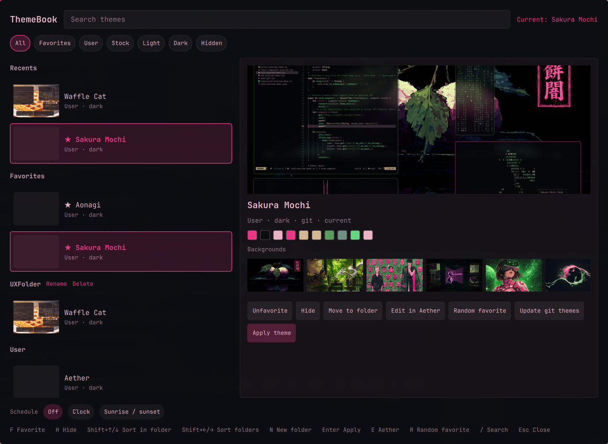

# ThemeBook

A windowed catalog of the themes already installed on [Omarchy](https://omarchy.org). Favorites sit at the top, you can group the rest into folders, preview before applying, hand a theme to [Aether](https://github.com/bjarneo/aether) to edit, and optionally switch day/night on a clock or at sunrise and sunset.

Plugin id: `io.github.calebhat.themebook`. MIT. Independent community plugin. Not affiliated with Omarchy or 37signals.

No sudo or pkexec is required. No network calls. No extra packages.

<p align="center"></p>

ThemeBook does not replace Super+Ctrl+Shift+Space. Stock Style > Theme still opens the carousel.

## Install

```sh
omarchy plugin add https://github.com/calebhat/omarchy-themebook.git --enable
omarchy restart shell
```

`omarchy plugin add` only clones files. It does not run a setup script. Enabling the plugin is the consent to load it in `omarchy-shell`. On first start, if you do not already have one, ThemeBook copies its Apps launcher into `~/.local/share/applications/`. It never overwrites that file, and it does not edit `omarchy-menu.jsonc`, Hyprland, or theme folders.

Open it from Apps (**ThemeBook**), or:

```sh
omarchy-shell shell toggle io.github.calebhat.themebook '{}'
```

Optional Style menu row — paste this yourself if you want it under Style:

```jsonc
"style.themebook": {"icon":"󰂺","label":"ThemeBook","action":"omarchy-shell shell toggle io.github.calebhat.themebook '{}'"}
```

into `~/.config/omarchy/extensions/omarchy-menu.jsonc`.

Optional float rule (Quickshell app-id is always `org.quickshell`):

```lua
o.window({ class = "^org.quickshell$", title = "^ThemeBook$" }, { float = true })
```

## Usage

- Click a card to select it. The desktop does not change until **Apply theme** (or Enter, or a double-click).
- Star favorites. They stay pinned at the top, in an order you set.
- Create folders and move themes into them. Deleting a folder ungroups; it never deletes a theme on disk.
- Hide themes you do not want in the main lists (filter chip **Hidden** brings them back).
- The backgrounds strip applies a wallpaper (`omarchy theme bg set`) using only images that belong to an installed theme.
- **Edit in Aether** is shown when `aether` is on `PATH`. Optional.
- **Update git themes** runs `omarchy theme update`. **Remove** is user-installed themes only, never the active theme, never stock.

Keyboard (also printed at the bottom of the window):

| Key | Action |
|---|---|
| `/` | Search |
| `j` / `k` or ↑ / ↓ | Move selection |
| `F` | Favorite |
| `H` | Hide |
| `Shift+↑/↓` | Sort inside the current folder or favorites |
| `Shift+←/→` | Reorder folders |
| `N` | New folder |
| `Enter` | Apply |
| `E` | Edit in Aether |
| `R` | Random favorite |
| `Esc` | Close |

## Schedule

Off by default. **Clock** switches at times you set (15-minute steps). **Sunrise / sunset** uses `sunwait` if installed and the same location file as weather. A manual apply is left alone until the next boundary.

If `acrogenesis.theme-scheduler` is enabled, ThemeBook’s scheduler stays off so the two do not fight.

## Config

Favorites, hidden slugs, folders, recents, and the schedule are stored at `~/.config/omarchy/themebook.json` when you change them. Theme directories are never written except through `omarchy theme set` / `bg set` / `remove` / `update`.

Local IPC (`omarchy-shell themebook …`) is the same user session as the shell. It only accepts installed theme slugs.

## Remove

```sh
omarchy plugin remove io.github.calebhat.themebook
```

That does not delete your themes. Leftovers you can delete yourself:

- `~/.local/share/applications/io.github.calebhat.themebook.desktop`
- an optional `style.themebook` row if you added one
- `~/.config/omarchy/themebook.json`

## License and dependencies

MIT — see [LICENSE](LICENSE).

Documented extra dependencies: none required.

Optional tools (already common on Omarchy, not installed by this plugin):

- `jq` — catalog JSON (Omarchy ships it)
- `aether` — **Edit in Aether**
- `sunwait` — sunrise/sunset schedule
- `uwsm-app` — launching Aether under UWSM when present

## Security notes

- Applies themes with `omarchy theme set <slug>` as argv, never `bash -c`.
- Background and preview paths must resolve under the theme’s own directories.
- Does not follow `backgrounds/` directory symlinks out of the theme tree.
- No network, no sudo, no pkexec, no pip, no setup script.
